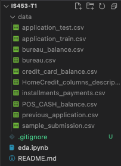

# Introduction

Project for IS453 Team 1  
Attempt at [kaggle competition](https://www.kaggle.com/c/home-credit-default-risk/overview) tackling Home Credit Default Risk

# Setup

Download the dataset from [here](https://www.kaggle.com/c/home-credit-default-risk/data)  
Click "download all"  
Place the files according to this  

# Running the application

1. Install docker on your computer
1. run `docker compose up --build -d`
1. The frontend application can be found at [localhost:3000](http://localhost:3000)
1. The backend application can be found at [localhost:5000](http://localhost:5000)
1. run `docker compose down` when you are finished

# Login credentials

1.  - username: mary
    - password: mary
1.  - username: john
    - password: john
